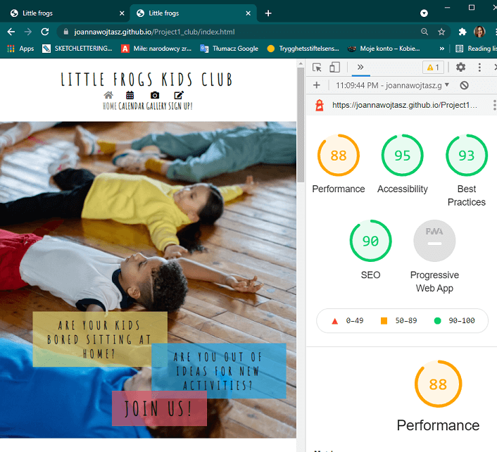

# Little frogs kis club 

**Version 1.0.0**

Little frogs is a webpage that hopes to help tired parents of small kids in the area of Göteborg, Sweden. the site is targeted towards parets with kis in age of 2-10 years who struggle to find activities to wear out kids daily activity.  Allowing kids playing together outdoors and patents to catch a breath.  Little frogs is helping new members to reach the "support village" and the current members to see the upcoming events and share some pictures.

 
mockup generated via https://techsini.com/multi-mockup/

## UX

### User stories

The visitor of the webpage expect/want/need:

1. What I would like to know from that website is clear information what is it about; moreover, what kind of activities are offered, when and where; would be nice to see some pictures of actual participants of events organized by the club, followed by some opinions that come from members.

2. Webpage should have a clear, easy-to-navigate layout, with enough information (but without "a lot to read").

3. To easily acces and look through upcoming events without confusing navigation through the page.

4. For the potential new members short accessible informatioion what the club is doing, how to conntact it and join.

### Wireframe mockups

* Index page

 

* Gallery

* signup

* calendar

### Changes

* Resign from the background shapes in the motto to  improve responsiveness of the design.
* Removed the speech-buble shape to increase readibility and improve design.
* Introduced an opinion field in sign-up page to allow members interaction.

## Features

#### Existing features

-__Navigation Bar__
* Featured on all the subpages and fully responsive navigation bar includes links to tha home page. calendar, gallery and sign up. 
* Thanks to identical layout on each pages it allows easy navigation between pages withoud need to use back button.

-__Index Page__

* The landing page includes a picture with overlayed text boxes. It introduces user to the problem the webpage responds to. 

-__The motto section__

* The paragraph that introduces users to the ida behind the kids club.

* A colorful pictures of kids playing a game outhords that visualise the possible activities the club offers.

-__Reasons section__

* This section shows the reasons to join the club presented from the perspective of kids, parent and possible benefits to the society.

* Different groups are visualised with three colorful boxes featuring pictures and list of reasons.

-__Map section__

* This section visualise map of the are where pottential users might be living and where the meeting are held.

* A descriotion of the meeting place and possible ways to get there is provided in the paragraph of text together with a picture of a child holding a map.

-__Opinions section__

* Introduce user to the reviews left by the members of the club.

* The sections offers users who are members an opportunity of leaving their own comment via clicking a link redirecting to a thre relevant page.

-__The Footer__

* The footer section includes links to the relevant social media sites for Litlle frogs kids club and an mail address. The links open in a new tab to allow easier navigation.

* The footer provides additional ways to conntact the club via mail and social media.

-__The Calendar__

* This section provides value to the user as it allows current and new members to preview the upcoming events. 

* The direct acces from the navbar allows current member to acces the calendar without scrolling through the page.

-__Gallery__

* The provides new users to look through the activities held by the club.

* The current members can look back at the pictures from the events their been part of.

-__Sign-up__

* This page allows new users to join the club. It features a form  allowing parents to leave contact details, as well as information about their childer, preferred activities and meeting frequency. 

* Current members can use this page to leave a comment.

#### Features left to implement

* The webpage could feature ideas for possible activities in the neibourhood when the club is not running any meetings.

## Testing

### Testing agains user stories

The visitor of the webpage expect/want/need:

1. What I would like to know from that website is clear information what is it about; moreover, what kind of activities are offered, when and where; would be nice to see some pictures of actual participants of events organized by the club, followed by some opinions that come from members.

- Little frogs webpages provides information about the kids cluvb for current and potential members. The index page is informatory with a simple introduction to what the club is together with members opinions and navigation to meeting places. To provide more information and as well as features for current members a separate pages were created for calendar, with selection of upcoming events, and a gallery,  with pictures to give user idea of the proposed activities. Different pages can be easily accesed by the navigation panel on top of every page. Little frogs webpage provides opportunity to conntact the club via Facebook, Instagram and mail. Links to the social media are provided in the footer. The members have also opportunity to leave comment. The field for leaving comment is in the signin page but it can be also accesed via a link in the opinions section on the index page.

2. Webpage should have a clear, easy-to-navigate layout, with enough information (but without "a lot to read").

- Little Frogs simple design allows user to easily reach simple information about kids club. The index page presents clubs motto, reasons to join, information about meeting place and members reviews. The navigationbar placed on the top of the page allows acces to the calendar wih information about upcoming events, gallery with selection of pictures from previous events and a signup page.

3. To easily acces and look through upcoming events without confusing navigation through the page.

- The calendar is placed in a separate tab, so that members of the club do not need to to scroll through the introduction on the index page to get the information about upcoming evemts. The o the top of the page

4. For the potential new members short accessible informatioion what the club is doing, how to conntact it and join.

  The index page tells potential users about the club while seperate page invite to sign in to the club. Additional contact information and social media accounts are provided in the footer on each page.

### Manual testing

 * manual code evaluation, cleaning-up the code structure and looking for missused commands, typos
   - [x] found multiple redundant lines, improved code organisation for readability.
   - [x] the form accepts digits for name - fixed by setting requirements for form input

 * testing in __different brosers__ and __screen sizes__ - the webpage was opened, scrolled-through and navigation between pages was tested on different browsers at desktop and mobile devices

 #### desktop
 * Google Chrome Version 91.0.4472.77
 * Firefox 89.0
 * Microsoft Edge Version 91.0.864.41

 All of the browsers showed good performance of the webpage.

 #### mobile

 * Chrome for Android
 * Safari for iOS

 Webpage worked correctly on different phones with Chrome and Safari browsers. 

 * __responsivness__ tests with Chrome developer tools
 
Chrome developer tools were used to simulate browsing the project on different screen sizes. This type of thesting was performed ongoing during page development as well as after deployment and the errors were fixed continuesly.

### Validator testing

#### HTMl validator https://validator.w3.org/

* Errors
- [x] Couple of minor errors such as leftout closing tags, missuse of textfield  and script left out of the body elemnt.

* Warnings:
- [ ] Missing section headers - the headers are missing due to design choices
- [ ] Empty heading - icon in navbar, followed by text in h2
- [ ] Possible misuse of aria-label
- [ ] Consider using the h1 element as a top-level heading only - h1 used in navbar
- [x] A table row was 3 columns wide, which is less than the column count established by the first row
 
#### CSS validator https://jigsaw.w3.org/css-validator/

- [x] One error - missing unit.

### Testing the webpage in the Chrom Lighthouse tool

* Desktop 

- [x] First raport showed issuses with the size signup background and resons image, the images were compressed.

* Mobile

- [ ] Porblems: lack of passive listeners on map element.
- [ ] Image elements do not have explicit width and height.
- [x] Font sizes in %
- [ ] Lack of contrast - the error is related to a hover, or active page link in navigation bar, as it becomes gray (from black) when in use, remaining fonts have apropriate contrast.

The Lighthouse tools provided satisfying response. Selected issues were fixed according to recived suggestions. Explenation of some of the remaining issues can be found above. 

## Encountered bugs

- [x] When updating layout of the menu, the  hover effect was lost. As a measure to fix the issue  code was reevaluated. The resaon was tag for initial color was more selective than hover selector. Using same lavel of selectors fixed the issure. Hover and active effekts work.

- [x] The footer on calendar page placed in the middle of viewport height. The issue was discussed during mentor session and solution wass propsed by mentor. The height of content section was set with use of min-height calculation. 

- [x] Issues with udjusting the table size and making it respononssive. The issue was fixed by setting size of table for each screen size separately. 

## Deployment

"- The site was deployed to GitHub pages. The steps to deploy are as follows: 
  - In the GitHub repository, navigate to the Settings tab 
  - From the source section drop-down menu, select the Master Branch
  - Once the master branch has been selected, the page will be automatically refreshed with a detailed ribbon display to indicate the successful deployment."

  (Description by Code Institue)

The live link can be found here - [Little frogs](https://joannawojtasz.github.io/Project1_club/)  

The deployment of the page did not provide any errors.

## Credits

The visual media origin from free resources of: 
* https://www.pexels.com/
* https://stocksnap.io/
* https://fontawesome.com/

The support and suggestions of Akshat Garg (Code Institute mentor) were applied.